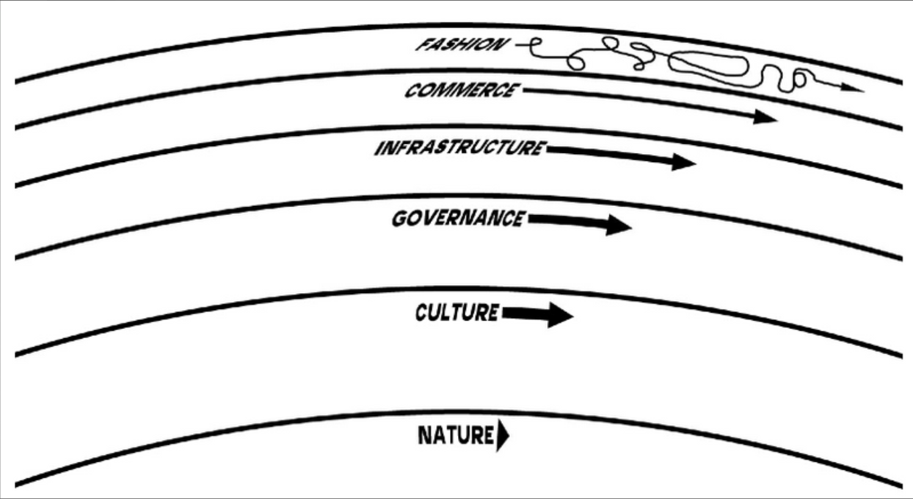

# To teach is to learn twice.

# What if the opposite of what you believe is true?

- I will lose respect if I fail
- I must specialize, stay in my lane
- I can't keep learning my whole career
- I can't know everything (at sufficient resolution)
- A good teacher can't fail in front of students
- My demos must work without error to be effective

# Expert does not know it all, but how to discover and use it all
- think about image compression into the RAM of your brain
- Before cloud we could fit the knowledge in, had to use references less
- Cloud means more data to store in same RAM, so STORE AT A LOWER RESOLUTION
  - Store how to find the data when you need it
    - Search terms to find reference pages

 # While depth of knowledge is useful for innovation and application (cloud projects)...
 # Breadth of knowledge is useful for learning and teaching

 - Compare the demand for introductory & beginner content to the demand for 'advanced training'
 - It's a privilege to be free to focus on the basics as a teacher 
  
# Learning one aspect of cloud teaches a pattern useful all cloud (Cloud widgets)
- ex. `Get-Command Get*VM* # replace VM with any other cloud widget` 

# See the [80/20 rule for learning cloud](https://github.com/dave-007/UG-Talk-Azure-Cloud-Journey-Of-The-DBA/blob/master/ACJOTD-Outline_WS.md#8020-rule-to-focus-your-study-on-the-skills-measured-most-exam-questions-address-the-same-aspects-for-any-azure-service)
- 
# We learn and teach more when it breaks than when it works
- Focus on troubleshooting, understanding and triaging the issue
# Seek competence, not mastery. Learn all at depth 1 or 2, with a few deep topics of strength.

# Learning 'approaches' in a spectrum between hello world tutorials and open hacks.

# Pace Layering - Cloud is built in layers, lower layer knowledge persists longer when upper layers more fragile

from https://jods.mitpress.mit.edu/pub/issue3-brand/release/2
 - What can you learn that changes slowly in the cloud?

# Evergreen tools and technologies

> Choose tools that can be applied in many scenarios, and will give you a leg up when engaging with a new technology.

 - Command line & shell (PowerShell & Bash)
 - Containers
 - Infrastructure as Code (Terraform)

# Command line is the cloud superpower
- Tools designed to be understood and applied by all cloud builders
- Learn once, apply anywhere
- Self documenting, repeatable, shareable, learnable
- Close to the 'metal' (ARM REST API) while being usable, right layer of abstraction

# Do you know about Microsoft's test algorithm that gives you bonus points for each Azure test you have taken in the past? 
# The more tests you take, the more bonus points you get on the next test!
- While this may not be ACTUALLY true, it is FUNCTIONALLY true
- The more tests you take, the EASIER they are to pass, as your knowledge about the shared characteristics of the cloud grows.
- Examples
  - RBAC
  - SKUs
  - Regions
  - Syntax
    - PowerShell
    - CLI
    - ARM
    - C#

# Training that is polished and professional can actually be less effective than raw live content with errors & typos.

- Can add 'distance' to be perceived as less attainable than a training that includes hiccups.
- Effort devoted to 'polish' can be better spent learning and sharing closer to real time.